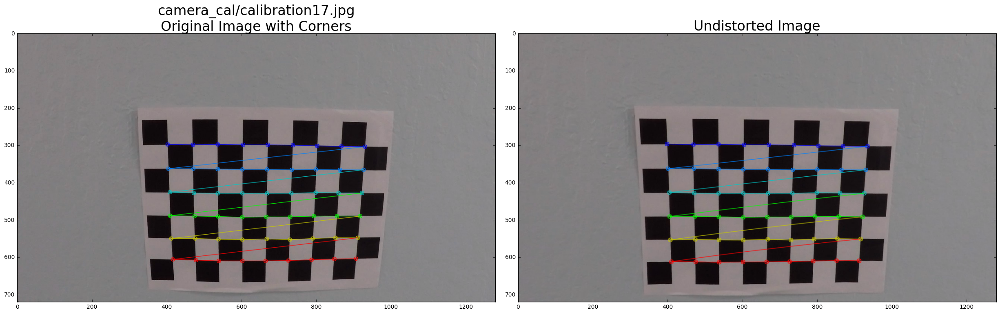
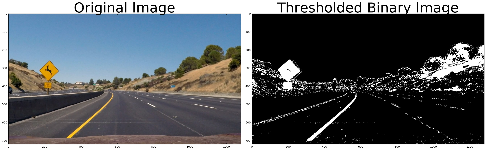
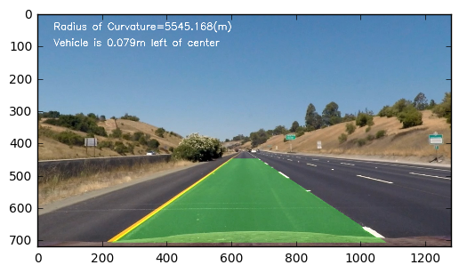
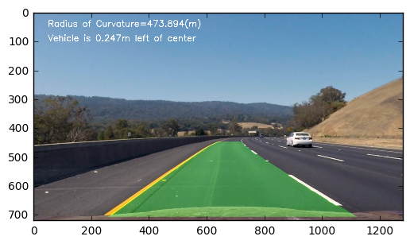
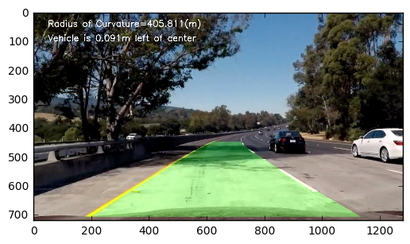
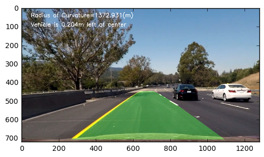

# Advanced Lane Finding Project

The related files are: 
* The writeup: this document you are reading now.
* Python code: `proj4.py`
* The generated video file: `result.mp4`

The goals / steps of this project are the following:

* Compute the camera calibration matrix and distortion coefficients given a set of chessboard images.
* Apply a distortion correction to raw images.
* Use color transforms, gradients, etc., to create a thresholded binary image.
* Apply a perspective transform to rectify binary image ("birds-eye view").
* Detect lane pixels and fit to find the lane boundary.
* Determine the curvature of the lane and vehicle position with respect to center.
* Warp the detected lane boundaries back onto the original image.
* Output visual display of the lane boundaries and numerical estimation of lane curvature and vehicle position.

# Camera Calibration

** Briefly state how you computed the camera matrix and distortion coefficients. Provide an example of a distortion corrected calibration image. **

** Answer: ** OpenCV equips functions to calculate the correct camera matrix and distortion coefficients. Twenty 9x6 chessboard images are provided for calibration. Note that some provided images are not recognized as 9x6 chessboard, therefore, I only used 17 of them. The distortion matrix is used to un-distort the calibration images. The undistorted calibration images are included in the next section for the purpose of demonstration that the calibration are correct.


```python
####### Camera Calibration ###########
import numpy as np
import cv2
import glob
import matplotlib.pyplot as plt
%matplotlib inline
```


```python
# Arrays to store object points and image points from all the images.
objpoints = [] # 3d points in real world space
imgpoints = [] # 2d points in image plane.
```


```python
# Make a list of calibration images
images = glob.glob('camera_cal/calibration*.jpg')
```


```python
# The following function returns the (1) camera calibration matrix (mtx); (2) distortion coefficients (dist); and (3) 
# undistorted image (undist)
def cal_undistort(img, objpoints, imgpoints):
    # Use cv2.calibrateCamera and cv2.undistort()
    ret, mtx, dist, rvecs, tvecs = cv2.calibrateCamera(objpoints, imgpoints, (img.shape[1], img.shape[0]),None,None)
    dst = cv2.undistort(img, mtx, dist, None, mtx)
    undist = np.copy(dst)  # Delete this line
    return mtx, dist, undist
```


```python
# Step through the list and search for chessboard corners
for image in images: # Here 'image' means the path-name of an image
    img = cv2.imread(image)
    #img2 = np.copy(img)
    gray = cv2.cvtColor(img,cv2.COLOR_BGR2GRAY)
    # There are 5 different sizes of the given calibration images
    nx=9
    ny=6
    img_size=(nx,ny)
    # chessboard size is (nx,xy)

    # prepare object points, like (0,0,0), (1,0,0), (2,0,0) ....,(6,5,0)

    objp = np.zeros((ny*nx,3), np.float32)
    objp[:,:2] = np.mgrid[0:nx,0:ny].T.reshape(-1,2)

    # Find the chessboard corners
    ret, corners = cv2.findChessboardCorners(gray, (nx,ny), None)

    # If found, add object points, image points
    if ret == True:
        print(image)
        objpoints.append(objp)
        imgpoints.append(corners)

        # Draw and display the corners
        #cv2.drawChessboardCorners(img2, (ny,nx), corners, ret)
        img2 = cv2.drawChessboardCorners(img, (nx,ny), corners, ret)
        mtx, dist, undistorted = cal_undistort(img, objpoints, imgpoints)
        # print(mtx) 
        # print(dist)
    
        f, (ax1, ax2) = plt.subplots(1, 2, figsize=(24, 9))
        f.tight_layout()
        ax1.imshow(img2)
        ax1.set_title(image+'\n'+'Original Image with Corners', fontsize=24)
        ax2.imshow(undistorted)
        ax2.set_title('Undistorted Image', fontsize=24)
        plt.subplots_adjust(left=0., right=1, top=0.9, bottom=0.)
```

    camera_cal/calibration10.jpg
    camera_cal/calibration11.jpg
    camera_cal/calibration12.jpg
    camera_cal/calibration13.jpg
    camera_cal/calibration14.jpg
    camera_cal/calibration15.jpg
    camera_cal/calibration16.jpg
    camera_cal/calibration17.jpg
    camera_cal/calibration18.jpg
    camera_cal/calibration19.jpg
    camera_cal/calibration2.jpg
    camera_cal/calibration20.jpg
    camera_cal/calibration3.jpg
    camera_cal/calibration6.jpg
    camera_cal/calibration7.jpg
    camera_cal/calibration8.jpg
    camera_cal/calibration9.jpg





# Distortion Correction

** Provide an example of a distortion-corrected image. **

** Answer:** In this section, I apply the camera matrix and distortion coefficients obtained in the previous section, to the test images. Distortion-corrected images are generated.


```python
# Make a list of raw images
images = glob.glob('test_images/*.jpg')
```


```python
for image in images:
    img = cv2.imread(image)
    img = cv2.cvtColor(img, cv2.COLOR_BGR2RGB) 
    # The image loaded by cv2 is BGR channel, should be transformed into RGB channels
    
    # The parameters of the following function (mtx and dist) is adopted from the previous step
    undistorted = cv2.undistort(img, mtx, dist, None, mtx)
    # parameters: objpoints, imgpoints; are obtained in the first step

    f, (ax1, ax2) = plt.subplots(1, 2, figsize=(24, 9))
    f.tight_layout()
    ax1.imshow(img)
    ax1.set_title('Original Image', fontsize=50)
    ax2.imshow(undistorted)
    ax2.set_title('Undistorted Image', fontsize=50)
    plt.subplots_adjust(left=0., right=1, top=0.9, bottom=0.)
```


#  Thresholded Binary Image Creation

** Describe how (and identify where in your code) you used color transforms, gradients or other methods to create a thresholded binary image. Provide an example of a binary image result.**

**Answer:** In this section, I defined several functions to create binary images that contain lane pixels. 
* The function `abs_sobel_thresh`: This is the Sobel operator for either $x$ or $y$ direction. The Sobel operator is at the heart of the Canny edge detection algorithm. Applying the Sobel operator to an image is a way of taking the derivative of the image in the $x$ or $y$ direction.
* The function `mag_thresh`: The magnitude, or absolute value, of the gradient is just the square root of the squares of the individual $x$ and $y$ gradients. For a gradient in both the $x$ and $y$ directions, the magnitude is the square root of the sum of the squares.
* The function `dir_threshold`: The direction of the gradient is simply the inverse tangent (arctangent) of the $y$ gradient divided by the $x$ gradient.
* The functions `hls_s` and `hls_h` perform color transfors.
* The function `thresholded_binary` combines the above four operators. The combination method is obtained by trial and error.


```python
############  Thresholded Binary Image Creation ####################
def abs_sobel_thresh(img, orient='x', sobel_kernel=3, thresh=(0, 255)):
    # 1) Convert to grayscale
    gray=cv2.cvtColor(img,cv2.COLOR_RGB2GRAY)
    # 2) Take the derivative in x or y given orient = 'x' or 'y'
    if orient == 'x':
        sobelxory=cv2.Sobel(gray,cv2.CV_64F,1,0)
    elif orient == 'y':
        sobelxory=cv2.Sobel(gray,cv2.CV_64F,0,1)
    else:
        print("orient should be 'x' or 'y'")
    # 3) Take the absolute value of the derivative or gradient
    abs_sobelxory=np.absolute(sobelxory)
    # 4) Scale to 8-bit (0 - 255) then convert to type = np.uint8
    scaled_sobel=np.uint8((255*abs_sobelxory)/np.max(abs_sobelxory))
    # 5) Create a mask of 1's where the scaled gradient magnitude 
            # is > thresh_min and < thresh_max
    sxbinary = np.zeros_like(scaled_sobel)
    sxbinary[(scaled_sobel >= thresh[0]) & (scaled_sobel <= thresh[1])] = 1    
    # 6) Return this mask as your binary_output image
    grad_binary = np.copy(sxbinary) 
    return grad_binary
```


```python
def mag_thresh(image,  sobel_kernel=3, mag_thresh=(0, 255)):
    # 1) Convert to grayscale
    gray=cv2.cvtColor(img,cv2.COLOR_RGB2GRAY)
    # 2) Take the gradient in x and y separately
    sobelx=cv2.Sobel(gray,cv2.CV_64F,1,0,ksize=sobel_kernel)
    sobely=cv2.Sobel(gray,cv2.CV_64F,0,1,ksize=sobel_kernel)
    # 3) Calculate the magnitude 
    abs_sobelxy = np.sqrt(sobelx**2  + sobely**2)
    # 4) Scale to 8-bit (0 - 255) and convert to type = np.uint8
    scale_sobelxy=np.uint8((255*abs_sobelxy)/np.max(abs_sobelxy))
    # 5) Create a binary mask where mag thresholds are met
    binary_sobelxy = np.zeros_like(scale_sobelxy)
    binary_sobelxy[(scale_sobelxy >= mag_thresh[0]) & (scale_sobelxy <= mag_thresh[1])] = 1
    # 6) Return this mask as your binary_output image
    mag_binary = np.copy(binary_sobelxy)
    return mag_binary
```


```python
def dir_threshold(image, sobel_kernel=3, thresh=(0, np.pi/2)):
    # 1) Convert to grayscale
    gray=cv2.cvtColor(img,cv2.COLOR_RGB2GRAY)
    # 2) Take the gradient in x and y separately
    sobelx=cv2.Sobel(gray,cv2.CV_64F,1,0,ksize=sobel_kernel)
    sobely=cv2.Sobel(gray,cv2.CV_64F,0,1,ksize=sobel_kernel)
    # 3) Take the absolute value of the x and y gradients
    abs_sobely = np.sqrt(sobely**2)
    abs_sobelx = np.sqrt(sobelx**2)
    # 4) Use np.arctan2(abs_sobely, abs_sobelx) to calculate the direction of the gradient
    dir_grad=np.arctan2(abs_sobely, abs_sobelx)
    # 5) Create a binary mask where direction thresholds are met
    binary_sobelxy = np.zeros_like(dir_grad)
    binary_sobelxy[(dir_grad >= thresh[0]) & (dir_grad <= thresh[1])] = 1
    # 6) Return this mask as your binary_output image
    dir_binary = np.copy(binary_sobelxy)
    return dir_binary
```


```python
# Define a function that thresholds the S-channel of HLS
def hls_s(img, thresh=(0, 255)):
    # 1) Convert to HLS color space
    # 2) Apply a threshold to the S channel
    # 3) Return a binary image of threshold result
    hls = cv2.cvtColor(img, cv2.COLOR_RGB2HLS)
    s = hls[:,:,2]
    retval, s_binary = cv2.threshold(s.astype('uint8'), thresh[0], thresh[1], cv2.THRESH_BINARY)
    return s_binary

# Define a function that thresholds the S-channel of HLS
def hls_h(img, thresh=(0, 255)):
    # 1) Convert to HLS color space
    # 2) Apply a threshold to the S channel
    # 3) Return a binary image of threshold result
    hls = cv2.cvtColor(img, cv2.COLOR_RGB2HLS)
    h = hls[:,:,0]
    retval, h_binary = cv2.threshold(h.astype('uint8'), thresh[0], thresh[1], cv2.THRESH_BINARY)
    return h_binary
```


```python
def thresholded_binary(img):
    gradx = abs_sobel_thresh(img, orient='x', sobel_kernel=ksize, thresh=(20,100))
    grady = abs_sobel_thresh(img, orient='y', sobel_kernel=ksize, thresh=(20,100))
    mag_binary = mag_thresh(img, sobel_kernel=ksize, mag_thresh=(30,100))
    dir_binary = dir_threshold(img, sobel_kernel=ksize, thresh=(0.7,1.3))
    
    sch = hls_s(img, thresh=(88, 190))
    hch = hls_h(img, thresh=(50, 100))
    
    combined = np.zeros_like(dir_binary)
    combined[((gradx == 1) & (grady == 1)) | ((mag_binary == 1) & (dir_binary == 1))|((sch>0) & (hch<=0))] = 1
    return combined
```


```python
# Choose a Sobel kernel size
ksize = 3 # Choose a larger odd number to smooth gradient measurements
```

The following codes generate the thresholded binary images.


```python
# Make a list of raw images
images = glob.glob('test_images/*.jpg')
for image in images:
    img = cv2.imread(image)
    img = cv2.cvtColor(img, cv2.COLOR_BGR2RGB) 
    
    undistorted = cv2.undistort(img, mtx, dist, None, mtx)
    combined=thresholded_binary(undistorted)
    
    
    f, (ax1, ax2) = plt.subplots(1, 2, figsize=(24, 9))
    f.tight_layout()
    ax1.imshow(img)
    ax1.set_title('Original Image', fontsize=50)
    ax2.imshow(combined,cmap='gray')
    ax2.set_title('Thresholded Binary Image', fontsize=50)
    plt.subplots_adjust(left=0., right=1, top=0.9, bottom=0.)
```





#  Perspective Transform

**Describe how (and identify where in your code) you performed a perspective transform and provide an example of a transformed image.**

**Answer:** 
* I investigated an image where the lane lines are straight, and find four points lying along the lines that, after perspective transform, make the lines look straight and vertical from a bird's eye view perspective. That is, the `src` four points form a trapezoidal shape, and the `dst` four points form a rectangle.
* I used OpenCV function, `cv2.getPerspectiveTransform(src,dst)`, to get transform matrix, and used `cv2.warpPerspective` to transform each image into a "birds-eye view". The inverse transform matrix could be obtained by `cv2.getPerspectiveTransform(dst,src)`. Transformed images are generated as below.


```python
########  Perspective Transform ###################

def perspective_transform(img):
    
    #gray = cv2.cvtColor(img,cv2.COLOR_BGR2GRAY)
    ret1, mtx, dist, rvecs, tvecs = cv2.calibrateCamera(objpoints, imgpoints, (img.shape[1], img.shape[0]),None,None)
        
    img_size=(img.shape[1],img.shape[0])
    # 1) Undistort using mtx and dist
    dstimg = cv2.undistort(img, mtx, dist, None, mtx)
    # 2) Convert to grayscale
    #gray = cv2.cvtColor(dstimg,cv2.COLOR_BGR2GRAY)
    # 3) Find the chessboard corners

    src = np.float32([[200,680],[582,450],[695,450],[1080,680]])
    # c) define 4 destination points dst = np.float32([[,],[,],[,],[,]])
    offset = 100 # offset for dst points
    dst = np.float32([[200,710], [200,40], [1085,40],[1085,710]])
    # d) use cv2.getPerspectiveTransform() to get M, the transform matrix
    M = cv2.getPerspectiveTransform(src, dst)
    Minv = cv2.getPerspectiveTransform(dst, src)
    # e) use cv2.warpPerspective() to warp your image to a top-down view
    warped = cv2.warpPerspective(dstimg, M, img_size, flags=cv2.INTER_LINEAR)
    return warped, Minv
```


```python
%matplotlib inline
images = glob.glob('test_images/*.jpg')
for image in images:
    img = cv2.imread(image)
    img=cv2.cvtColor(img,cv2.COLOR_BGR2RGB)
    
    
    undistorted = cv2.undistort(img, mtx, dist, None, mtx)
    combined=thresholded_binary(undistorted)
    warped,Minv = perspective_transform(combined)
    

    f, (ax1, ax2) = plt.subplots(1, 2, figsize=(24, 9))
    f.tight_layout()
    ax1.imshow(img)
    ax1.set_title('Original Image', fontsize=50)
    ax2.imshow(warped,'gray')
    ax2.set_title('Perspective Transformed Image', fontsize=50)
    plt.subplots_adjust(left=0., right=1, top=0.9, bottom=0.)
```


# Find Lane Boundary, Lane Curvature, and Vehicle Position

**Describe how (and identify where in your code) you identified lane-line pixels and fit their positions with a polynomial?**

**Answer:** 
* After applying calibration, thresholding, and a perspective transform to a road image, we have a binary image where the lane lines stand out clearly. In order to decide explicitly which pixels are part of the lines and which belong to the left line and which belong to the right line, a histogram could be used. With this histogram I am adding up the pixel values along each column in the image. In my thresholded binary image, pixels are either 0 or 1, so the two most prominent peaks in this histogram will be good indicators of the x-position of the base of the lane lines. I can use that as a starting point for where to search for the lines. From that point, I can use a sliding window, placed around the line centers, to find and follow the lines up to the top of the frame. [The above methods are suggested by the course materials.]
* Then, [Radius of Curvature](http://www.intmath.com/applications-differentiation/8-radius-curvature.php) could be computed. Note that I am fitting for $f(y)$, rather than $f(x)$, because the lane lines in the warped image are near vertical and may have the same $x$ value for more than one $y$ value. Besides, the radius of curvature may be given in meters.
* In what follows, I computes left-lane-line, right-lane-line, and average them to obtain the center-line. Left-lane-line is `left_fitx`; right-lane-line is `right_fitx`; and the center-line is `avg_fitx`.
* We can assume the camera is mounted at the center of the car and the deviation of the midpoint of the lane from the center of the image is the offset we're looking for. Therefore, offset could be obtained by the difference between the middle point of the image ($x$ direction) and the bottom end point of the center-line. Converting from pixels to meters, the offset is: `offset= (avg_fitx[-1]-640)*xm_per_pix`.


```python
#### Find Lane Boundary, Lane Curvature, and Vehicle Position ####################
def finding_lines(binary_warped): 
    # Assuming you have created a warped binary image called "binary_warped"
    # Take a histogram of the bottom half of the image
    histogram = np.sum(binary_warped[binary_warped.shape[0]/2:,:], axis=0)
    # Create an output image to draw on and  visualize the result
    out_img = np.dstack((binary_warped, binary_warped, binary_warped))*255
    # Find the peak of the left and right halves of the histogram
    # These will be the starting point for the left and right lines
    midpoint = np.int(histogram.shape[0]/2)
    leftx_base = np.argmax(histogram[:midpoint])
    rightx_base = np.argmax(histogram[midpoint:]) + midpoint

    # Choose the number of sliding windows
    nwindows = 9
    # Set height of windows
    window_height = np.int(binary_warped.shape[0]/nwindows)
    # Identify the x and y positions of all nonzero pixels in the image
    nonzero = binary_warped.nonzero()
    nonzeroy = np.array(nonzero[0])
    nonzerox = np.array(nonzero[1])
    # Current positions to be updated for each window
    leftx_current = leftx_base
    rightx_current = rightx_base
    # Set the width of the windows +/- margin
    margin = 100
    # Set minimum number of pixels found to recenter window
    minpix = 50
    # Create empty lists to receive left and right lane pixel indices
    left_lane_inds = []
    right_lane_inds = []

    # Step through the windows one by one
    for window in range(nwindows):
        # Identify window boundaries in x and y (and right and left)
        win_y_low = binary_warped.shape[0] - (window+1)*window_height
        win_y_high = binary_warped.shape[0] - window*window_height
        win_xleft_low = leftx_current - margin
        win_xleft_high = leftx_current + margin
        win_xright_low = rightx_current - margin
        win_xright_high = rightx_current + margin
        # Draw the windows on the visualization image
        cv2.rectangle(out_img,(win_xleft_low,win_y_low),(win_xleft_high,win_y_high),(0,255,0), 2) 
        cv2.rectangle(out_img,(win_xright_low,win_y_low),(win_xright_high,win_y_high),(0,255,0), 2) 
        # Identify the nonzero pixels in x and y within the window
        good_left_inds = ((nonzeroy >= win_y_low) & (nonzeroy < win_y_high) & (nonzerox >= win_xleft_low) & (nonzerox < win_xleft_high)).nonzero()[0]
        good_right_inds = ((nonzeroy >= win_y_low) & (nonzeroy < win_y_high) & (nonzerox >= win_xright_low) & (nonzerox < win_xright_high)).nonzero()[0]
        # Append these indices to the lists
        left_lane_inds.append(good_left_inds)
        right_lane_inds.append(good_right_inds)
        # If you found > minpix pixels, recenter next window on their mean position
        if len(good_left_inds) > minpix:
            leftx_current = np.int(np.mean(nonzerox[good_left_inds]))
        if len(good_right_inds) > minpix:        
            rightx_current = np.int(np.mean(nonzerox[good_right_inds]))

    # Concatenate the arrays of indices
    left_lane_inds = np.concatenate(left_lane_inds)
    right_lane_inds = np.concatenate(right_lane_inds)

    # Extract left and right line pixel positions
    leftx = nonzerox[left_lane_inds]
    lefty = nonzeroy[left_lane_inds] 
    rightx = nonzerox[right_lane_inds]
    righty = nonzeroy[right_lane_inds] 

    # Fit a second order polynomial to each
    left_fit = np.polyfit(lefty, leftx, 2)
    right_fit = np.polyfit(righty, rightx, 2)
    
    # Generate x and y values for plotting
    ploty = np.linspace(0, binary_warped.shape[0]-1, binary_warped.shape[0] )
    left_fitx = left_fit[0]*ploty**2 + left_fit[1]*ploty + left_fit[2]
    right_fitx = right_fit[0]*ploty**2 + right_fit[1]*ploty + right_fit[2]

    out_img[nonzeroy[left_lane_inds], nonzerox[left_lane_inds]] = [255, 0, 0]
    out_img[nonzeroy[right_lane_inds], nonzerox[right_lane_inds]] = [0, 0, 255]
    
    #plt.figure()
    #plt.imshow(out_img)
    #plt.plot(left_fitx, ploty, color='yellow')
    #plt.plot(right_fitx, ploty, color='yellow')
    #plt.xlim(0, 1280)
    #plt.ylim(720, 0)
    return out_img, left_fitx, right_fitx, ploty
```

The curvature and offset along with the lane lines are shown as below.


```python
images = glob.glob('test_images/*.jpg')
for image in images:
    img = cv2.imread(image)
    img=cv2.cvtColor(img,cv2.COLOR_BGR2RGB)
    
    
    undistorted = cv2.undistort(img, mtx, dist, None, mtx)
    combined=thresholded_binary(undistorted)
    warped, Minv = perspective_transform(combined)
    out_img, left_fitx, right_fitx, ploty = finding_lines(warped)
    avg_fitx=(left_fitx+right_fitx)/2
    center_fit=np.polyfit(ploty, avg_fitx, 2)
    #.....................................................................
    # Define y-value where we want radius of curvature
    # I'll choose the maximum y-value, corresponding to the bottom of the image
    y_eval = np.max(ploty)
    center_curverad = ((1 + (2*center_fit[0]*y_eval + center_fit[1])**2)**1.5) / np.absolute(2*center_fit[0])
    #print(center_curverad)
    # Example values: 1926.74 1908.48
    #.....................................................................
    # Define conversions in x and y from pixels space to meters
    ym_per_pix = 30/720 # meters per pixel in y dimension
    xm_per_pix = 3.7/700 # meters per pixel in x dimension

    # Fit new polynomials to x,y in world space
    center_fit_cr= np.polyfit(ploty*ym_per_pix, avg_fitx*xm_per_pix, 2)
    # Calculate the new radii of curvature
    center_curverad = ((1 + (2*center_fit_cr[0]*y_eval*ym_per_pix + center_fit_cr[1])**2)**1.5) / np.absolute(2*center_fit_cr[0])
    # Now our radius of curvature is in meters
    print('Curvature= ',center_curverad, 'm')
    # Example values: 632.1 m    626.2 m
    #.....................................................................
    offset= (avg_fitx[-1]-640)*xm_per_pix
    print('Offset= ',offset,'m')
 
    

    f, (ax1, ax2) = plt.subplots(1, 2, figsize=(24, 9))
    f.tight_layout()
    ax1.imshow(img)
    ax1.set_title('Original Image', fontsize=50)
    
    ax2.imshow(out_img,'gray')
    ax2.plot(left_fitx, ploty, color='yellow')
    ax2.plot(right_fitx, ploty, color='yellow')
    ax2.plot(avg_fitx, ploty, color='yellow')
    plt.xlim(0, 1280)
    plt.ylim(720, 0)
    
    ax2.set_title('The finded Lane Boundary', fontsize=50)
    plt.subplots_adjust(left=0., right=1, top=0.9, bottom=0.)
```

    /Users/adm/anaconda/envs/keras/lib/python3.5/site-packages/ipykernel/__main__.py:5: VisibleDeprecationWarning: using a non-integer number instead of an integer will result in an error in the future


    Curvature=  5545.16786394 m
    Offset=  0.0790221471392 m
    Curvature=  44213.6031611 m
    Offset=  0.114947725004 m
    Curvature=  854.148523716 m
    Offset=  0.27644088092 m
    Curvature=  297.086032472 m
    Offset=  0.386767191139 m
    Curvature=  473.893679844 m
    Offset=  0.247007925447 m
    Curvature=  820.852338831 m
    Offset=  0.366359050844 m
    Curvature=  405.810585001 m
    Offset=  0.090557404202 m
    Curvature=  1372.93105766 m
    Offset=  0.203950701048 m














# Pipeline: Drawing the Detected Lane on the Undistorted Image

In this final section, I put all functions together, and plotted back down onto the road such that the lane area is identified clearly.


```python
ret, mtx, dist, rvecs, tvecs = cv2.calibrateCamera(objpoints, imgpoints, (img.shape[1], img.shape[0]),None,None)
```


```python
def process_image(image):
    # NOTE: The output you return should be a color image (3 channel) for processing video below
    # TODO: put your pipeline here,
    # you should return the final output (image with lines are drawn on lanes)
    global mtx,dist
    img = cv2.imread(image) 
    img=cv2.cvtColor(img,cv2.COLOR_BGR2RGB) 
    
    #img=np.copy(image)
    undistorted = cv2.undistort(img, mtx, dist, None, mtx)
    
    combined=thresholded_binary(undistorted)
    warped, Minv = perspective_transform(combined)
    out_img, left_fitx, right_fitx, ploty = finding_lines(warped)
    avg_fitx=(left_fitx+right_fitx)/2
    center_fit=np.polyfit(ploty, avg_fitx, 2)
    #.....................................................................
    # Define y-value where we want radius of curvature
    # I'll choose the maximum y-value, corresponding to the bottom of the image
    y_eval = np.max(ploty)
    center_curverad = ((1 + (2*center_fit[0]*y_eval + center_fit[1])**2)**1.5) / np.absolute(2*center_fit[0])
    #print(center_curverad)
    #.....................................................................
    # Define conversions in x and y from pixels space to meters
    ym_per_pix = 30/720 # meters per pixel in y dimension
    xm_per_pix = 3.7/700 # meters per pixel in x dimension

    # Fit new polynomials to x,y in world space
    center_fit_cr= np.polyfit(ploty*ym_per_pix, avg_fitx*xm_per_pix, 2)
    # Calculate the new radii of curvature
    center_curverad = ((1 + (2*center_fit_cr[0]*y_eval*ym_per_pix + center_fit_cr[1])**2)**1.5) / np.absolute(2*center_fit_cr[0])
    # Now our radius of curvature is in meters
    #print('Curvature= ',center_curverad, 'm')
    #.....................................................................
    # Create an image to draw the lines on
    warp_zero = np.zeros_like(warped).astype(np.uint8)
    color_warp = np.dstack((warp_zero, warp_zero, warp_zero))

    # Recast the x and y points into usable format for cv2.fillPoly()
    pts_left = np.array([np.transpose(np.vstack([left_fitx, ploty]))])
    pts_right = np.array([np.flipud(np.transpose(np.vstack([right_fitx, ploty])))])
    pts = np.hstack((pts_left, pts_right))

    # Draw the lane onto the warped blank image
    cv2.fillPoly(color_warp, np.int_([pts]), (0,255, 0))

    # Warp the blank back to original image space using inverse perspective matrix (Minv)
    newwarp = cv2.warpPerspective(color_warp, Minv, (img.shape[1], img.shape[0])) 
    # Combine the result with the original image
    result = cv2.addWeighted(undistorted, 1, newwarp, 0.3, 0)

    return result
```


```python
images = glob.glob('test_images/*.jpg')
for image in images:
    result=process_image(image)
    
    plt.figure()
    plt.imshow(result)
```

    /Users/adm/anaconda/envs/keras/lib/python3.5/site-packages/ipykernel/__main__.py:5: VisibleDeprecationWarning: using a non-integer number instead of an integer will result in an error in the future


The following codes are used for generating video file.


```python
######################################################

#from moviepy.editor import VideoFileClip
import os
from moviepy.editor import VideoFileClip

video_output = 'result0.mp4'
clip1 = VideoFileClip("project_video.mp4")
video_clip = clip1.fl_image(process_image) #NOTE: this function expects color images!!
video_clip.write_videofile(video_output, audio=False)
```

** Finally, the generated video file is `result.mp4`.**


```python

```
